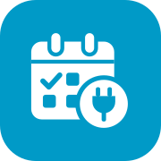
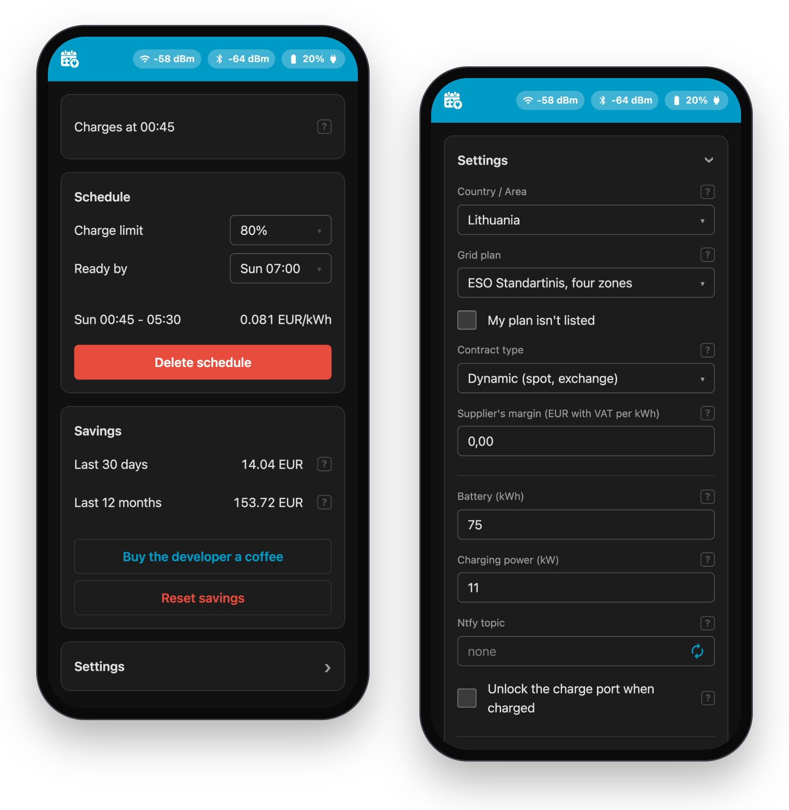
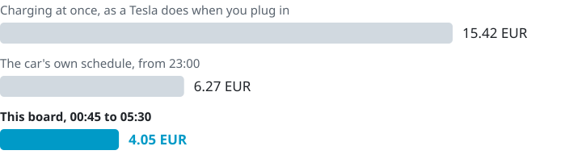
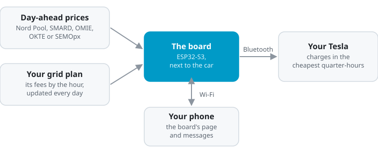

# ESPHome Tesla BLE Scheduler

**Charge your Tesla in the cheapest hours of the night, automatically.** 
A small ESP32 board by the car follows the electricity market and controls charging over Bluetooth.

[Install](#install) · [How it works](#how-it-works) · [Countries](plans/README.md) · [User guide](docs/guide.md) · [Contributing](CONTRIBUTING.md)

## Why

Day-ahead electricity prices change every quarter-hour, and the cheapest hours of a night often cost a fraction of the evening peak. A Tesla's own schedule knows times, not prices, and the tools that follow prices usually need a cloud service, your Tesla account, Home Assistant or a new charger.

This board needs none of them. When you plug in, it picks the cheapest quarter-hours that still get the car to its charge limit by the time you leave, counting your grid fees and VAT.

- **Runs at home:** no cloud, no Tesla account, no subscription, no Home Assistant.
- **Can only charge:** its key can't open the car or drive it.
- **Works in 26 European countries,** most with their grid operators' plans built in.
- **Updates from its own page,** with releases signed by the project.

## What it saves

One ordinary night in Lithuania, 27 September 2026: a 75 kWh car plugs in at 18:00 with 20% and needs 80% by 07:00, on Nord Pool prices and a grid plan with four zones, VAT included.

<picture>
  <source media="(prefers-color-scheme: dark)" srcset="docs/images/savings-dark.svg">
  
</picture>

That's 74% less than charging at once, and 35% less than the car's own schedule, as the board finds the cheap hours wherever they fall. The costs are its scheduler's, run on the published prices.

## How it works

<picture>
  <source media="(prefers-color-scheme: dark)" srcset="docs/images/how-it-works-dark.svg">
  
</picture>

1. **Prices:** the board downloads tomorrow's prices once they're out, around 13:00 CET, and adds VAT and your grid plan's fees to each quarter-hour.
2. **Schedule:** when you plug in, it picks the cheapest quarter-hours that reach your charge limit by **Ready by**, with a spare one in case charging runs slow.
3. **Charging:** it starts and stops the car over Bluetooth, and sends the schedule to your phone through the ntfy app, if you like.

## What you need

- A Tesla Model 3, Model Y, Cybertruck, or Model S/X from 2021 on.
- An ESP32-S3-DevKitC-1 (N16R8) board, within Bluetooth range of the car and on your Wi-Fi.
- A USB-C cable for your computer, and a USB-C phone charger near the car to power the board.
- A home charger that charges whenever the car asks: no schedule, auto-lock or app approval (OCPP) of its own.
- A price that follows the day-ahead market, often called spot or exchange price, in one of the [26 countries](plans/README.md), which also says how to use a fixed price instead.
- Chrome or Edge on a computer, for the first install.

## Install

1. Plug the board's USB-C port labelled **COM** into your computer.
2. Download [the firmware](https://github.com/zygimantas/esphome-tesla-ble-scheduler/releases/latest/download/esphome-tesla-ble-scheduler.bin), open [ESPHome Web](https://web.esphome.io) in Chrome or Edge, and install it as the video shows:

https://github.com/user-attachments/assets/47da88c6-9992-4ed4-9c16-b7fc7fbd02fe

3. On the board's page, which ESPHome Web opens, choose your country, grid plan and contract, then scan the QR code with your phone.
4. Plug the board into the phone charger near the car, sit in the car with your key card, and finish the setup on your phone:

https://github.com/user-attachments/assets/41fc06e6-78c6-4639-b068-f61f561c2c50

From then on, just plug in: the car is charged by **Ready by**. The [user guide](docs/guide.md) explains the page, phone messages and what to do when something is off.

## For developers

The scheduler is plain C++17 that runs on a computer as well as on the board.

- **Tested:** 85 unit tests cover every line and branch of the scheduler, mutation testing kills 92% of its mutants, and a simulation runs the board's logic with a simulated Tesla.
- **Built on ESPHome:** an external component in `scheduler/`, with [esphome-tesla-ble](https://github.com/yoziru/esphome-tesla-ble) for the car, and a page of plain JavaScript and CSS that the board serves.
- **Checked in CI:** clang-tidy, CodeQL, SonarCloud and the page's tests in a headless browser, and every release signed for the boards' updates.
- **Open to your country:** a grid operator's plan is a short YAML file in `plans/`, which every board downloads within a day.

[CONTRIBUTING.md](CONTRIBUTING.md) has the checks to run and how releases are made.

## Support

If it saves you money, you can [buy the developer a coffee](https://buymeacoffee.com/zygimantas_berziunas). Questions and ideas are welcome as [issues](https://github.com/zygimantas/esphome-tesla-ble-scheduler/issues).

## Credits and license

The Bluetooth link to the car is [esphome-tesla-ble](https://github.com/yoziru/esphome-tesla-ble), which implements Tesla's [vehicle-command](https://github.com/teslamotors/vehicle-command) protocol. Prices come from Nord Pool's data portal, SMARD (Bundesnetzagentur | SMARD.de, CC BY 4.0), OMIE (OMI-Polo Español, S.A.), OKTE (OKTE, a.s.) and SEMOpx (the market of Ireland and Northern Ireland). This project isn't affiliated with Tesla, Nord Pool, the Bundesnetzagentur, OMIE, OKTE, SEMOpx or any grid operator. Use it at your own risk.

Licensed under the [GNU Affero General Public License v3.0](LICENSE).
